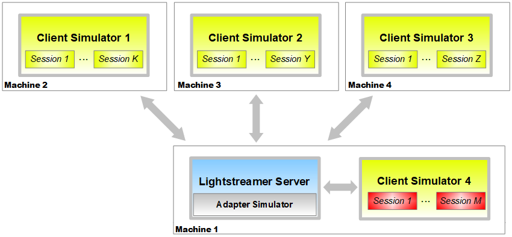

Lightstreamer – Load Test Toolkit
=================================

###### Version 4.0, October 1, 2018 

User's Guide
------------

<!-- START doctoc generated TOC please keep comment here to allow auto update -->
<!-- DON'T EDIT THIS SECTION, INSTEAD RE-RUN doctoc TO UPDATE -->
**Table of Contents**

- [Introduction](#introduction)
- [Architecture](#architecture)
  - [Simple Case](#simple-case)
  - [Scaling to more Client Simulators](#scaling-to-more-client-simulators)
  - [Latency Reporting](#latency-reporting)
  - [Overcoming TCP Port Limits](#overcoming-tcp-port-limits)
- [Getting Started with the First Test](#getting-started-with-the-first-test)
  - [Prepare the Two Machines](#prepare-the-two-machines)
  - [Install the Software on Machine 1](#install-the-software-on-machine-1)
  - [Install the Software on Machine 2](#install-the-software-on-machine-2)
  - [Run the Test and Monitor the System](#run-the-test-and-monitor-the-system)
- [General Tests and System Tuning](#general-tests-and-system-tuning)
  - [Tuning the Software and the Operating System](#tuning-the-software-and-the-operating-system)
  - [Activating Latency Reporting](#activating-latency-reporting)
- [Scalability vs. Latency](#scalability-vs-latency)

<!-- END doctoc generated TOC please keep comment here to allow auto update -->

# Introduction

The **Lightstreamer Load Test Toolkit** (**LLTT**) has been developed to
help performing load tests on Lightstreamer Server. It complements,
rather than replacing, any third-party software that supports
Lightstreamer. In particular, the LLTT is made up of an Adapter
Simulator and a Client Simulator. This means it is quite useful in the
preliminary phases of a project, when no Adapters and Clients have been
developed yet, but it is necessary to do a capacity planning of the
system based on different load scenarios. When the system has been fully
developed (including Lightstreamer Adapters and Clients), it is possible
to use other off-the-shelf products to load test the Server while
targeting the real Adapters and simulating the real Clients.

This user's guide describes the architecture of the LLTT and provides
the instructions on how to configure, deploy, and run it.

Full Java source code for both the Adapter Simulator and the Client
Simulator are provided in the LLTT package, to enable any required
customization.

# Architecture

**Session**: a Lightstreamer session that simulates a user. Every
session subscribes to one or more items and receives updates from
Lightstreamer Server.

**Client Simulator**: a standalone application that creates a configured
number of sessions in streaming mode.

**Adapter Simulator**: a Lightstreamer Data Adapter that generates items
and updates based on its configuration.

There are several possibilities when choosing how many Client Simulators
to use and where to deploy them. In the sections below we will go
through some of them.

## Simple Case

In the simplest case, there are two machines involved in the test: one
machine hosting a Client Simulator and one machine hosting the
Lightstreamer Server (whose process includes the Adapter Simulator). In
this case, Client Simulator 1, running on Machine 2, will create K
sessions. The value of K depends on the hardware characteristics of
Machine 1 and the heaviness of the subscribed data.


## Scaling to more Client Simulators

If Machine 1 does not scale enough to simulate the required number of
users, more machines can be added hosting more Client Simulators, as
shown below.


## Latency Reporting

The LLTT includes a facility to accurately measure and statistically
analyze latencies for the pushed data.

Activating latency reporting on a Client Simulator makes it much less
scalable. So it is a good practice to generate most of the load on a
number of Client Simulators with latency reporting turned off. Then you
can use a further Client Simulator with latency reporting turned on,
simulating a much smaller number of clients. This will be a good sample
of the global latency distribution.

For the latency reporting system to show reliable results the machine
hosting the Lightstreamer Server and the machine hosting the Client
Simulator with latency reporting on should have their clocks
synchronized. You may use NTP to synchronize the clocks of those
machines: <http://www.ntp.org/> .

The Client Simulator with latency reporting on can also be deployed
directly on the same machine of the Server (provided that the Client
Simulator process does not result too much resource intensive) thus
avoiding the complexity of clocks synchronization and removing any
network latencies. This scenario leads to the architecture below:

M is usually a small number, to avoid stealing CPU cycles from the
Lightstreamer Server, which is the subject under observation. If Client
Simulator 4 is deployed on a dedicated machine, then M could be larger.



**NOTE**: If testing a “broadcasting” scenario (that is, a few items
subscribed to by all clients) the delays may not be randomly distributed
among the clients; in other words, some clients may always receive
updates before other clients do, so some clients may experience
latencies constantly lower than average, while other clients may
experience latencies constantly higher. This must be taken into account
when analyzing the latency statistics and when determining a suitable
value for M.

## Overcoming TCP Port Limits

When you need to simulate very high numbers of users (hundreds of
thousands or millions) and each machine dedicated to Client Simulators
needs to go beyond 64K TCP connections, you have to configure
Lightstreamer Server to listen on multiple TCP ports and to set
“serverPorts” parameter (in the XML configuration file of the Client
Simulator) to the number of configured server ports.

For example if the Server listens on ports 80, 81 and 82 (NB ports
numbers have to be adjacent), then you have to set “port” parameter to
80 (the base port) and “serverPorts” to 3 (because the server listens on
three ports starting from port number 80) in the Client Simulator
configuration file.

**NOTE**: In order to be able to open 50,000 or more client ports, you
may need to increase the default port range of the underlying operating
system, as explained below.

  - **Linux**: 
	  - Find the current port range: *sysctl
	    net.ipv4.ip\_local\_port\_range*
	  - Set a new port range: *sudo sysctl -w
	    net.ipv4.ip\_local\_port\_range="1024 64000"*
	  - You may need to edit “/etc/sysctl.conf” file to make changes to
	    /proc filesystem permanently. For example, append the following to
	    your “/etc/sysctl.conf” file: *net.ipv4.ip\_local\_port\_range =
	    1024 65535*

<!-- end list -->

  - **Windows**:

	  - Set the following registry key to
	    64000:  
	    *HKEY\_LOCAL\_MACHINE\\SYSTEM\\CurrentControlSet\\Services\\Tcpip\\Parameters\\MaxUserPort*
    
On Linux, the limit on the open files also has to be set higher than
the expected number of connections.  
The launch script, “**start\_client.sh**”, tries to raise the “soft”
limit up to the “hard” limit granted to the user. Check if you have
to raise the user's “hard” limit as well.

# Getting Started with the First Test

Let's set up the system for a simple test. As for the instructions
below, we will refer to a simple deployment on two machines: **Machine
1** hosting Lightstreamer Server and** Machine 2** hosting an instance
of the Client Simulator.

Configuration of the Adapter Simulator and the Client Simulator is as
follows:

  - 100 sessions are created by the Client Simulator
  - 500 items are generated by the Adapter Simulator
  - 5 items are subscribed to by each session, taken from the 500
    available items
  - for each item, the Adapter Simulator generates one update every 3
    seconds
  - each update is made up of 5 fields
  - each field has a payload of 10 bytes

## Prepare the Two Machines

Make sure the latest version of the chosen **operating system **is being
used, with all the patches and updates applied.

Install the latest available release of Java SE Development Kit on both
the machines. If you need to use several gigabytes of memory, you need
to install the 64-bit version of the JDK.

## Install the Software on Machine 1

Install **Lightstreamer Server v. 6.1 (or newer)** on the Server
machine, configure it following the GETTING\_STARTED.TXT instructions contained in the package, and verify
that it works correctly, by running one of the preinstalled demos. 

**NOTE**: If you use Lightstreamer 6.1.0, then you need
Allegro/Presto/Vivace for the test, as Lightstreamer Moderato is not
compatible with LLTT. If you use Lightstreamer 7 or higher, then, to
fully leverage the LLTT features, you need to configure the
Lightstreamer server with Enterprise Edition, since with Community
Edition the test could be compromised by the limitations of the edition.

Open **lightstreamer\_conf.xml** (under the “conf” folder) and make sure
you have the following settings:

  - \<**max\_buffer\_size**\> should be set to **10** (this will avoid
    buffering too much data in case a Client Simulator should saturate
    its own CPU)
  - \<**disable\_session\_mbeans**\> (directly under the \<JMX\> block)
    should be left unset, or set to **Y**
  - \<**delta\_delivery**\> should be set to **N** (this turns off the
    algorithm that compares subsequent updates on the same item in order
    to extract and send only the delta)
  - \<**reuse\_pump\_buffers**\> should be set to **Y** (unless you are
    simulating a very large number of sessions with a very low update
    rate)
  - \<**sendbuf**\> should be set to **5000** (this will reduce the
    latencies, especially on the local loop)

The above settings are suitable for the test scenario. If your
production scenario calls for different values for some of these
settings, you may evaluate the related impact on performances.

Open **lightstreamer\_log\_conf.xml** (under the “conf” folder) and make
sure you have the following settings:

  - The “**LSProducer**” appender should be changed as follows (to avoid
    flooding the Monitor Console channel with useless activity
    messages):

	```
	<appender name="LSProducer" class="com.lightstreamer.logback.ProducerAppender">  
		<filter class="ch.qos.logback.classic.filter.ThresholdFilter">  
			<level>warn</level>  
		</filter>  
	</appender>  
	```

  - The “**LSConsole**” appender should be changed as follows (to avoid
    flooding the Console shell with useless activity messages):

	```
	<appender name="LSConsole" class="ch.qos.logback.core.ConsoleAppender">  
		<filter class="ch.qos.logback.classic.filter.ThresholdFilter">  
			<level>warn</level>  
		</filter>  
		<encoder>  
			<pattern>%d{"dd.MMM.yy HH:mm:ss,SSS"} &lt;%5.5(%p%marker)&gt; %m%n</pattern>  
		</encoder>  
	</appender>  
	```

  - The “**LightstreamerMonitorText**” and “**LightstreamerMonitorTAB**”
    categories should be changed as follows (to log the monitoring info
    more often and disable the tabular version of the same):

	```
	<logger name="LightstreamerMonitorText" level="TRACE">  
		<appender-ref ref="LSDailyRolling" />  
	</logger>

	<logger name="LightstreamerMonitorTAB" level="ERROR">  
		<appender-ref ref="LSDailyRolling" />  
	</logger>
	```

  - The “**LightstreamerLogger.pump**” category should be changed as
    follows (to avoid flooding the log with possible loops of
    notifications of lost updates):

	```
	<logger name="LightstreamerLogger.pump" level="WARN" />
	```  

Install the **Adapter Simulator**: open the “adapters” folder of the
Lightstreamer Server installation and copy the “AdapterSimulator” folder
from the LLTT inside it.

## Install the Software on Machine 2

To install the **Client Simulator**, copy the “ClientSimulator” folder
from the LLTT to Machine 2.

Edit the launch script file (“**start\_client.sh**” for Linux, or
“**start\_client.bat**” for Windows) in order to set the correct
location of the JVM to use.

Edit the **configuration.xml** file and specify the address of Machine 1
as the “host” parameter.

## Run the Test and Monitor the System

The default configuration of the Adapter Simulator and the Client
Simulator is as follows:

  - 100 sessions are created by the Client Simulator
  - 500 items are generated by the Adapter Simulator
  - 5 items are subscribed to by each session, taken from the 500
    available items
  - for each item, the Adapter Simulator generates one update every 3
    seconds
  - each update is made up of 5 fields
  - each field has a payload of 10 bytes

Launch Lightstreamer Server on Machine 1.

Launch the Client Simulator on Machine 2.

While the test is running, it is a good idea to monitor the systems and
application resources. In particular, the following observations are
recommended:

  - Monitor the **CPU usage** of *both* the Server and the Clients.
  - Open the **Monitoring Dashboard** of Lightstreamer Server in your
    browser (by default, it is available via the “/dashboard/” URI).
  - Check the **Lightstreamer Server log**, where the Monitor info is
    reported periodically and any errors will appear.
  - Check the **Lightstreamer Server console output**, where any error
    related to heap memory exhaustion will be reported.
  - Check the **Client Simulator logs**, where information on test
    progression and any error will be reported.
  - Check any **network bottlenecks** and other issues by using the
    ***ifconfig*** and ***netstat –statistics*** commands (on Linux
    machines). Look for lost and retransmitted packets.

# General Tests and System Tuning

You can configure the LLTT to reflect a broad range of simulation
scenarios. You may increase the total number of items, change the update
frequency, change the update size, change the number of items subscribed
to by each session, run the test with TLS, enforce http streaming
instead of WebSocket, etc.

_Refer to the inline comments within **adapters.xml** (for Adapter
Simulator) and **configuration.xml** (for Client Simulator) to know the
meaning of the available parameters._

Both the Client Simulator and the Adapter Simulator contain their own
log4j configuration file, which can be edited: log\_conf.xml for the
Client; **adapter\_log\_conf.xml **for the Adapter.

In case you need to simulate **very low frequency scenarios**, where no
updates should be sent to a session for several seconds or even minutes,
you should take into considerations the keep-alive messages. When no
data is flowing on a stream connection, Lightstreamer Server sends small
**keep-alive messages** to keep the connection open. The frequency of
such keep-alive messages is configured in **lightstreamer\_conf.xml**,
via the \<default\_keepalive\_millis\> element. The default
configuration is 5 seconds.

In case of a test with TLS, make sure that the client process is granted
enough memory, by manually changing the JVM\_PROPERTIES in the
*start\_client* script. The memory requirements related with the
handling of TLS is on the order of a few tens of KB.

In case the data generation activity requested to the Adapter Simulator
is quite intense, it is a good idea to perform a preliminary test where
the Adapter Simulator is launched as a stand-alone process. This way, it
is possible to measure how much CPU and run it will steal to
Lightstreamer Server during the actual test. The
“optional\_standalone\_launcher.sh” and
“optional\_standalone\_launcher.bat” script files are supplied for
this purpose (you may need to edit
them).

## Tuning the Software and the Operating System

Edit **LS.sh** (under the “bin/unix-like” folder) or **LS.bat** (under
the “bin\\windows” folder) as follows:

  - If needed, tune the **Java heap configuration** (min and max memory)
    by editing the **JAVA\_OPTS** parameter. You may need to allocate
    much more memory for more intense tests.
  - If needed, tune the **JVM garbage collector** by adding specific
    fields to the **JAVA\_OPTS** parameter. Again, for a basic test the
    default garbage collector should be good.
  - On Linux and UNIX, increase the **file descriptor** limit, possibly
    setting it to unlimited.

Open **lightstreamer\_conf.xml** (under the “conf” folder) and ensure
that all the configuration settings under the “LOAD CONFIGURATION”
section are left to their defaults. This ensures, in particular, that
the pools devoted to internal CPU-bound tasks (i.e. the “events pool”
and the “pump pool”) contain one thread per each available core.

Using a **Gigabit Ethernet** or better is recommended for the tests.

To allow very high numbers of incoming connections, you may need some
further tuning of the operating system. For **Linux**, below is a
*tentative* list of possible settings. You should put such settings in
“/etc/sysctl.conf” then run *sysctl -p* to apply them. There should be
no need to reboot.

net.core.wmem\_max = 33554432

net.ipv4.tcp\_rmem = 4096 87380 33554432

net.ipv4.tcp\_wmem = 4096 65536 33554432

net.ipv4.tcp\_mem = 786432 1048576 26777216

net.ipv4.tcp\_max\_tw\_buckets = 360000

net.core.netdev\_max\_backlog = 2500

net.ipv4.netfilter.ip\_conntrack\_max = 1048576

vm.min\_free\_kbytes = 65536

net.ipv4.ip\_local\_port\_range = 1024 65535

For instance, on **Linux**, if the **nf\_conntrack** module is loaded,
it may introduce a limit on the connections, which can be enlarged
through the *net.ipv4.netfilter.ip\_conntrack\_max* setting. In fact, we observed such
a limit to be set with a default of about 260000 connections when
deploying the Server through a Docker container.

## Activating Latency Reporting

To turn on latency reporting on a Client Simulator instance, you need to

  - Set \<param name="**injectTimestamps**"\> to **true** in the
    **adapters.xml** file of Lightstreamer Server.
  - Set priority value to **INFO** for the
    "**com.lightstreamer.load\_test.reports.latency\_reporting**"
    category in the **log\_conf.xml** file of the Client Simulator,
    before launching the
client.

# Scalability vs. Latency

Load testing is a complex discipline, as many variables usually tend to
affect the results. Once some variables have been fixed, others can be
tuned to optimized the performance.

After the following variables have been fixed:

  - Platform and hardware configurations
  - Application scenario (that is, concurrent sessions, number of items,
    event frequencies, etc.)

more variables can be tuned that affect a very important trade-off:
**scalability vs. latency**.

Usually, the higher is the acceptable latency for the event dispatching,
the higher is the scalability in terms of concurrent sessions.

The main parameters affecting that trade-off are the following:

  - Configuration of the **max\_delay\_millis** element in
    lightstreamer\_conf.xml. It sets the longest delay that the Server
    is allowed to apply to outgoing updates in order to collect more
    updates in the same TCP packet. Even small values (5 or 10
    milliseconds) can provide great benefits in terms of scalability
    with respect to the scenario where 0 is used. Being able to forge
    larger TCP packets provide benefits to both network usage and CPU
    usage.

  - Configuration of the **garbage collection** algorithm of the Java
    Virtual Machine. The Java garbage collection strategy has a direct
    impact over the real-time grade of the system and induced latencies.
    In order to reduce the maximum latencies, a garbage collector that
    provides continuous collection (rather than periodically suspending
    the application) should be chosen (again, as part of a trade-off
    with scalability).

  	Tuning the garbage collection requires specific skills, because several
	collection algorithms with different specific parameters are provide by
	Oracle/Sun’s JVM. Please look for the Garbage Collection Tuning Guide
	for your Java installation for an overview of the available algorithms.

	If you experience bad performance, try this GC configuration. Edit
	LS.s, go to JAVA\_OPTS, and use the following string in place of the
	default one: "*-server -XX:NewRatio=1 -XX:SurvivorRatio=4 -Xms256M
	-Xmx4G*" (this will reduce the occurrence of major garbage collections
	in favor of minor ones). In case of a test with TLS, the heap limit may
	need to be higher.

  
	For scenarios where a true pauseless garbage collection is required (to
	minimize latencies without reducing scalability) specific Java platforms
	exist. For example, see Azul Systems
	([www.azulsystems.com](http://www.azulsystems.com/)).
